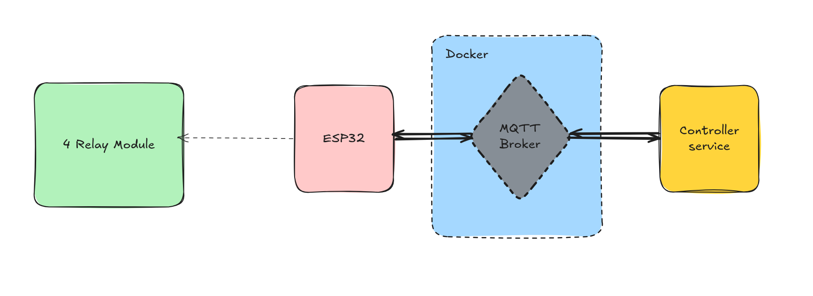

<p align="center">
    
</p>

<p align="center">
    <em>ESP32 Real-Time Controller - Full Project (v0.1) | </em>
    <em><b>⚠️ Project under development</b></em>
</p>

This repository contains the complete source code for the ESP32 Real-Time Controller, divided into two main components: the Python Backend and the C-based Firmware.

In version 0.1, the system architecture is kept highly simplified. The primary focus is strictly on sending real-time commands from the backend to the ESP32 hardware to turn a 4-relay module ON or OFF. Databases, state reporting, and advanced fault tolerance (like LWT) are planned for future releases.

## 🛠 Technology Stack

### Backend
* **Core Framework:** FastAPI (Python)
* **Messaging Protocol:** MQTT (using the `aiomqtt` library for asynchronous communication)
* **Infrastructure:** Docker (for running the MQTT Broker)

### Firmware (Hardware Node)
* **Framework:** ESP-IDF (v6.0.2)
* **Programming Language:** C
* **Operating System:** FreeRTOS (Ensuring non-blocking network communication)
* **Drivers & Components:** `esp_wifi`, `mqtt`, `esp_sntp`, `esp_driver_gpio`, `freertos`

## 🏗 Software Architecture & Topics

### Firmware Modular Design
The ESP32 codebase follows the Separation of Concerns principle and is divided into specific modules:
* `wifi_manager`: Manages network connections.
* `mqtt_manager`: Handles the connection to the MQTT broker and subscribes to command topics.
* `sntp_manager`: Synchronizes system time (NTP).
* `app_tasks`: Manages FreeRTOS tasks and uses `command_queue` for thread-safe command execution.

### MQTT Topic Structure
Currently, the backend only sends execution commands to the hardware node.
* **Send Command:** `devices/{device_id}/relay/{relay_id}/set`

## 🚀 Quick Start Setup

### 1. Run the MQTT Broker
Ensure that your MQTT Broker is up and running inside a Docker container.

### 2. Backend Setup
Navigate to the backend directory, install the required packages, and run the server:

``` bash
pip install -r requirements.txt
uvicorn main:app --host 0.0.0.0 --port 8000
```
### 3. Firmware Setup & Flashing
Navigate to the firmware directory. Configure your Wi-Fi credentials and MQTT Broker URI, then build and flash to your ESP32:

``` bash
idf.py menuconfig
idf.py fullclean
idf.py build
idf.py -p /dev/ttyUSB0 flash monitor
```
*(Adjust the serial port based on your operating system).*

## 📌 Development Status (v0.1)
- [x] Backend: Connect to the MQTT Broker using FastAPI.
- [x] Backend: Send ON/OFF commands to the hardware.
- [x] Firmware: Stable modular connection to Wi-Fi and MQTT Broker.
- [x] Firmware: Thread-safe toggling of GPIO pins connected to relays.
- [ ] Receive relay state data from ESP32 (Planned for next version).
- [ ] Add Redis/SQLite databases for saving logs and states (Planned for next version).
- [ ] Detect node disconnection via LWT (Planned for next version).
- [ ] Save relay states in Non-Volatile Storage (NVS) (Planned for next version).